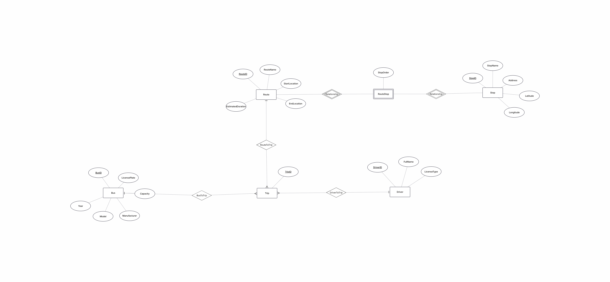
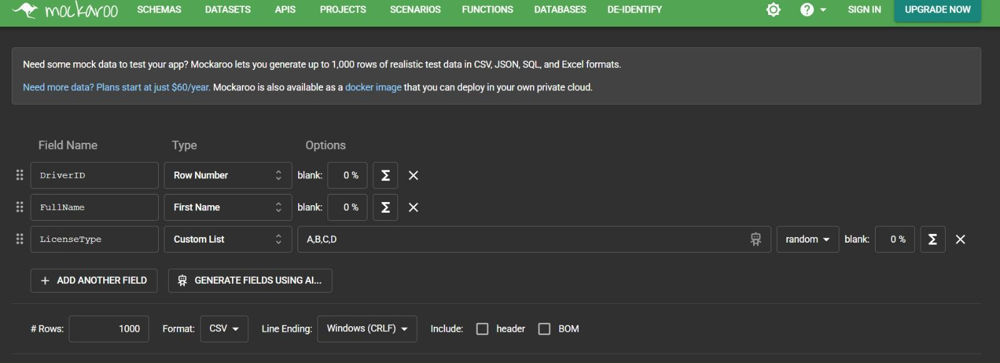
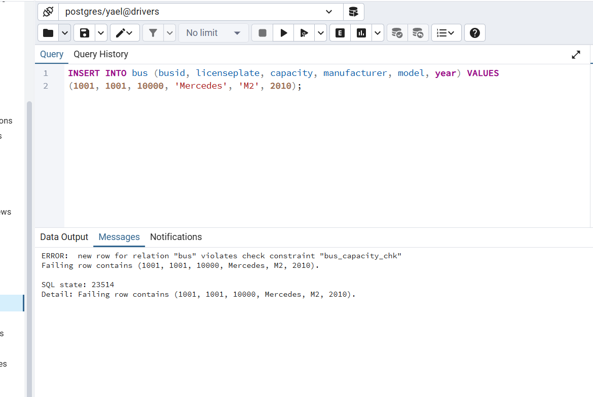
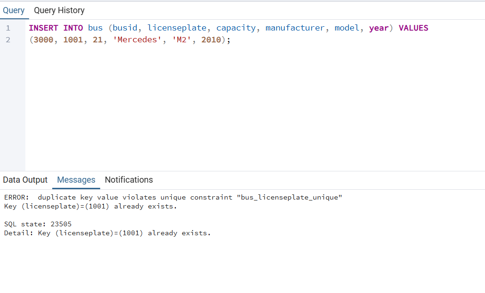
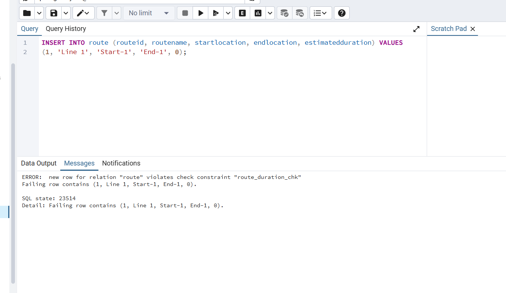
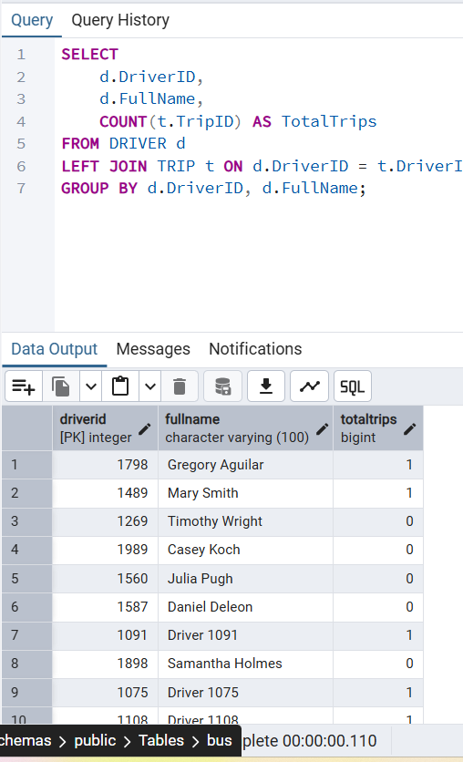
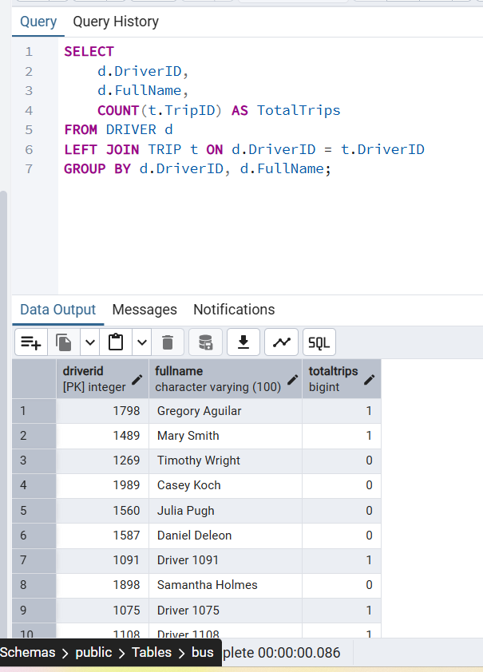
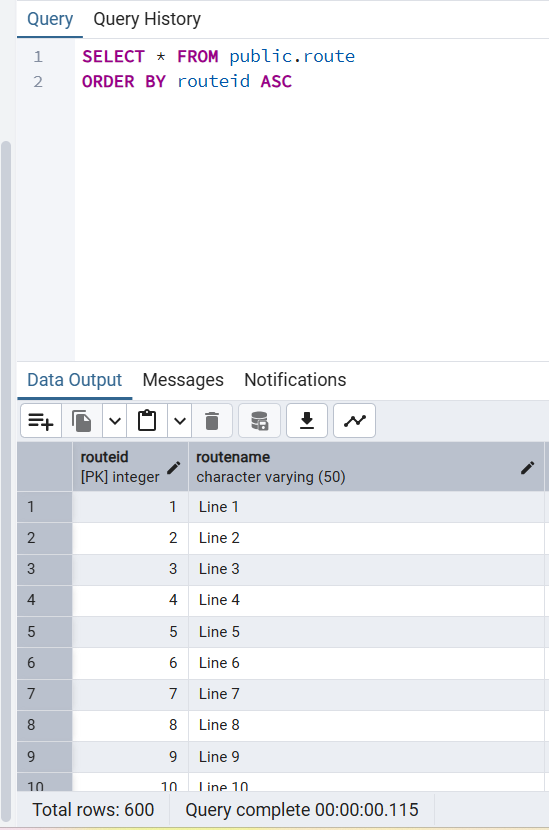
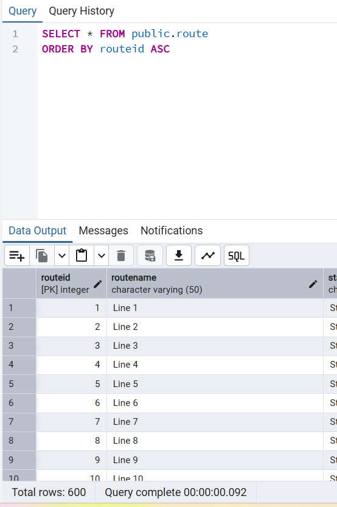
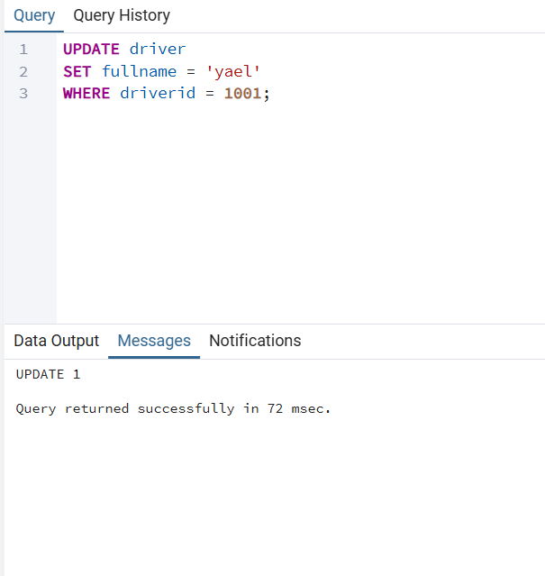

# drivers
#  דוח פרויקט 

## מגישות

* יפית כהן
* יעל שניאור

## המערכת

מערכת לניהול נהגים (Driver Management System)

##  היחידה הנבחרת

ניהול נהגים 

---

# שלב א

## תוכן עניינים

1. מבוא
2. מסכים שנוצרו בעזרת AI
3. קישור למערכת
4. תרשימי ERD ו-DSD
5. החלטות עיצוב
6. הכנסת נתונים
7. גיבוי ושחזור
8. סיכום

---

## מבוא

המערכת שפותחה היא מערכת לניהול נהגים, שמטרתה לאפשר ניהול יעיל ומסודר של כלל המידע הקשור לנהגים, רכבים ופעילותם.

המערכת שומרת נתונים על מספר ישויות מרכזיות:

* נהגים – פרטים אישיים כגון שם, תעודת זהות, פרטי קשר ועוד
* נסיעות / משימות – מידע על נסיעות שבוצעו או מתוכננות, כולל שיוך נהג לרכב

בנוסף, המערכת מנהלת קשרים בין הישויות השונות, כך שכל נהג יכול להיות משויך לרכב אחד או יותר, וכל נסיעה מקושרת לנהג ולרכב הרלוונטיים.

הפונקציונליות העיקרית של המערכת כוללת:

* הוספה, עדכון ומחיקה של נהגים, רכבים ונסיעות
* צפייה ושליפה של מידע בצורה נוחה
* שמירה על עקביות הנתונים ומניעת כפילויות

מטרת המערכת היא לספק פתרון נוח לניהול נתונים תפעוליים, ולאפשר גישה מהירה למידע, בקרה על פעילות ושיפור תהליכי עבודה.

---

## מסכים שנוצרו בעזרת AI

סרטון ההדגמה (`20260429-0828-44.1746523.mp4`) וצילומי המסכים נמצאים בפרויקט.

**[מעבר לתיקיית screens](./screens/)**

---

##  קישור למערכת

https://ais-pre-77dfnjtpiym64oo7ugmese-644835111717.europe-west2.run.app/
---

## תרשימי ERD ו-DSD

הקבצים המקוריים נמצאים בתיקייה `erd-diagram`.

### ERD

### DSD

---

##  החלטות עיצוב

במהלך תכנון המערכת התקבלו מספר החלטות עיצוביות:

* בוצעה הפרדה בין ישויות מרכזיות (נהגים,מנהל ונסיעות) על מנת לשמור על מבנה נתונים ברור ומסודר
* לכל טבלה הוגדר מפתח ראשי (Primary Key) המאפשר זיהוי ייחודי של כל רשומה
* נעשה שימוש במפתחות זרים (Foreign Keys) ליצירת קשרים בין טבלאות, למשל בין נהגים לנסיעות ובין רכבים לנסיעות
* בוצע נרמול של הנתונים על מנת למנוע כפילויות ולשמור על עקביות הנתונים
* המבנה שנבחר מאפשר הרחבה עתידית של המערכת ללא צורך בשינויים משמעותיים

---

##  הכנסת נתונים

הנתונים הוכנסו למערכת בשלוש שיטות שונות:

### הכנסת נתונים ידנית (INSERT)
ניתן לראות את הקבצים של השאילתות בתוך התקיה scripts

### 2. ייבוא נתונים מקובץ CSV

יצרנו קבצי CSV בעזרת האתר Mockaroo ואז ייבאנו אותם דרך pgAdmin.

**צילום מסך Mockaroo**

**קבצי CSV לייבוא:** [`MOCK_DATA_bus.csv`](./mockData/MOCK_DATA_bus.csv), [`MOCK_DATA_driver.csv`](./mockData/MOCK_DATA_driver.csv) (בתיקייה `mockData/`)

### 3. הכנסת נתונים באמצעות סקריפט
 יצרנו סקריפט בפיתון שמייצר לנו נתונים בצורה של insert values   ואת הנתונים האלו הרצנו ב PgAdmin 

---

## גיבוי ושחזור

### גיבוי ושחזור נתונים

---

## סיכום

בשלב זה של הפרויקט נבנתה תשתית מלאה לניהול נתונים הכוללת:

* תכנון מבנה בסיס הנתונים
* יצירת טבלאות וקשרים בין ישויות
* הכנסת נתונים במספר שיטות שונות
* הצגת נתונים באמצעות מסכים שנוצרו בעזרת AI
* ביצוע פעולות גיבוי ושחזור

המערכת מהווה בסיס להמשך פיתוח, וניתן להרחיב אותה בעתיד בהתאם לצרכים נוספים.

---

# שלב ב

## תוכן עניינים

1. [שאילתות (`SELECT`), עדכונים (`UPDATE`) ומחיקות (`DELETE`)](#סיכום-נסיעות-לפי-נהג)
2. [אילוצים (`Constraints.sql`)](#אילוצים-נוספים-constraintssql)
3. [אינדקסים (`Index.sql`)](#אינדקסים-indexsql)
4. [תועלות האילוצים והאינדקסים](#תועלות-האילוצים-והאינדקסים)
5. טרנזקציות — [`ROLLBACK`](#טרנזקציה-עם-rollback-סעיף-8) · [`COMMIT`](#טרנזקציה-עם-commit-סעיף-9)

---

## סיכום נסיעות לפי נהג

שתי השאילתות מציגות עבור כל נהג את שמו ואת מספר הנסיעות שביצע במערכת. המידע נשלף מטבלת הנהגים יחד עם טבלת הנסיעות. הקוד המלא נמצא בקובץ [`scripts/Queries.sql`](./scripts/Queries.sql).

### גרסה ראשונה – JOIN ו-GROUP BY

הגרסה הראשונה משתמשת ב־`JOIN` בין `DRIVER` ל־`TRIP` וב־`GROUP BY` לפי מזהה הנהג ושמו, ומחשבת את מספר הנסיעות עם `COUNT`. השיטה הזו יעילה יותר, מכיוון שהיא מבצעת חישוב אחד כולל על כל הנתונים ומקבצת אותם יחד.

### גרסה שנייה – Subquery מתואם

הגרסה השנייה בוחרת כל נהג מטבלת `DRIVER`, ובעמודת מספר הנסיעות משתמשת בתת־שאילתה שסופרת (`COUNT`) את הרשומות ב־`TRIP` שמתאימות לאותו נהג. השיטה פחות יעילה, מכיוון שהיא מריצה שאילתת `COUNT` נפרדת עבור כל נהג, מה שגורם להרבה חזרות של חישוב (N פעמים). לכן עבור כמויות נתונים גדולות, הגרסה הראשונה עדיפה מבחינת ביצועים.

## נסיעות לפי נהג ויום (לוח שנה)

השאילתה מציגה את כל הנסיעות של נהג מסוים ביום מסוים, כולל פרטי המסלול, האוטובוס והסטטוס של כל נסיעה, לצורך הצגה בלוח שנה במערכת. שתי הגרסאות בקובץ [`scripts/Queries.sql`](./scripts/Queries.sql).

### גרסה ראשונה – JOIN

הגרסה הראשונה (`JOIN`) יעילה יותר משום שהיא מבצעת חיבור ישיר בין הטבלאות ומביאה את כל הנתונים הנדרשים בפעולה אחת.

בנוסף, `JOIN` מאפשר החזרת מידע עשיר יותר (שם מסלול, אוטובוס וכו') ולכן מתאים יותר להצגה במסך לוח שנה.

### גרסה שנייה – Subquery עם IN

לעומת זאת, הגרסה השנייה (`Subquery` עם `IN`) פחות יעילה מכיוון שהיא מבצעת בדיקה נוספת של `RouteID` בתוך תת־שאילתה, מה שמוסיף עלות חישובית מיותרת.

## בקשות לביטול נסיעות (מסך מנהל)

שאילתות שמציגות למנהל נסיעות לטיפול בבקשות ביטול (`Pending Cancellation`), עם פרטי מסלול ואוטובוס. הקוד ב־[`scripts/Queries.sql`](./scripts/Queries.sql).

### גרסה ראשונה – JOIN (TRIP, ROUTE, BUS)

חיבור `TRIP` ל־`ROUTE` ול־`BUS` בלבד — שלוש טבלאות ב־`JOIN`, בלי גישה ל־`DRIVER`. מתאים כשמספיקים פרטי נסיעה, מסלול ורכב.

### גרסה שנייה – JOIN כולל DRIVER

מוסיפה `JOIN` ל־`DRIVER` ומסננת לפי `Status = 'Pending Cancellation'`, כשצריך לשייך במפורש את הנתונים גם לנהג.

## מסך נסיעות כללי (נסיעות עתידיות)

שאילתות המציגות נסיעות במצב `Active` או `Pending Cancellation` — מסך ריכוז כל הנסיעות הרלוונטיות מבחינת סטטוס, עם פרטי מסלול ואוטובוס (בגרסת ה־`JOIN`) או שם נהג ושם קו בלבד דרך תת־שאילתות מתואמות (בגרסה השנייה). הקוד ב־[`scripts/Queries.sql`](./scripts/Queries.sql).

### גרסה ראשונה – JOIN

חיבור `TRIP` ל־`ROUTE` ול־`BUS` בשאילתה אחת, סינון לפי שני הסטטוסים ומיון לפי תאריך הנסיעה — שליפה יעילה כשצריך עמודות רבות מהמסלול ומהאוטובוס.

### גרסה שנייה – תת־שאילתות מתואמות

שליפת שם הנהג ושם הקו באמצעות תת־שאילתות עבור כל שורה מ־`TRIP`; פחות עמודות מגרסת ה־`JOIN`, אך עלות גבוהה יותר כשרשומות רבות כי החיפוש חוזר על עצמו לכל נסיעה.

## שליפות נוספות 

### 1. פרטי נהג למסך ראשי (`screen-1.png`)

**מטרה:** להציג לנהג מחובר (או לפי מזהה שנבחר) את פרטי הפרופיל הבסיסיים מהטבלה `DRIVER`.

**מה השאילתה עושה:** בוחרת את `DriverID`, `FullName` ו־`LicenseType` עבור רשומה אחת, לפי `WHERE DriverID = …` (בדוגמה בקובץ: `1002`). אין צורך ב־`JOIN` כי כל המידע נמצא בטבלת הנהגים.

### 2. היסטוריית נסיעות (נסיעות שכבר עברו)

**מטרה:** דוח או מסך שמציג נסיעות מהעבר, כולל הנהג, המסלול והאוטובוס — לצורכי ארכיון, דוחות או מעקב.

**מה השאילתה עושה:** מבצעת `JOIN` בין `TRIP`, `DRIVER`, `ROUTE` ו־`BUS`. התנאי `(t.TripDate)::date < CURRENT_DATE` משאיר רק נסיעות שהתאריך שלהן לפני היום הנוכחי (ב־PostgreSQL). המיון `ORDER BY t.TripDate DESC` מציג את האחרונות בזמן בראש הרשימה.

**הערות לשימוש:** דורש עמודות `TripDate` (ולמשל `Status`) בטבלת `TRIP`. אם מוצגות גם נסיעות של היום, יש להחליף את התנאי בהתאם (`<=` או טווח תאריכים).

### 3. רשימת נהגים (`screen-2.png`)

**מטרה:** טבלת ניהול נהגים הדומה למסך הרשימה במערכת: שם, מזהה, טלפון, מספר רישוי (לוחית) וסוג אוטובוס בעברית.

**מה השאילתה עושה:**  
תת־שאילתה עם `DISTINCT ON (d.DriverID)` אחרי `LEFT JOIN` ל־`TRIP` ול־`BUS`: לכל נהג נבחרת **נסיעה אחת** — זו עם `TripID` הגבוה ביותר (`ORDER BY d.DriverID, t.TripID DESC NULLS LAST`), כלומר שיוך האוטובוס האחרון הידוע.  
עמודת `Bus` נגזרת מ־`Capacity`: עד 20 מקומות «מיניבוס», עד 50 «אוטובוס עירוני», אחרת «אוטובוס תיירותי». נהג ללא נסיעות יקבל `NULL` ברישוי ובסוג האוטובוס. השכבה החיצונית ממיינת לפי `DriverName`.

**הערות לשימוש:** נדרשת עמודת `Phone` ב־`DRIVER`. מספר הרישוי מגיע מ־`BUS.LicensePlate`.

### 4. לוח נסיעות לנהג – חודש מלא (`screen-8.png`)

**מטרה:** למסך לוח השנה של הנהג: שליפת **נסיעות בודדות** בחודש ובשנה נבחרים, עם יום, שעה, יעד ושם קו.

**מה השאילתה עושה:**  
`JOIN` בין `TRIP` ל־`ROUTE`. מסננת לפי `DriverID`, לפי שנה וחודש מתוך `TripDate`, דורשת `TripDate IS NOT NULL`, ומוציאה נסיעות שסטטוסן `Cancelled` באמצעות `t.Status IS DISTINCT FROM 'Cancelled'` (ב־PostgreSQL התנאי כולל גם שורות עם `Status` ריק, ואינו מוציא אותן בטעות בגלל `NULL`).  
`TripDay` הוא התאריך בלבד; `TripTime` מפורמט מ־`TripDate` (אם העמודה היא `date` בלי שעה, השעה עלולה להופיע כ־`00:00`); `Destination` לפי `EndLocation`.

**הערות לשימוש:** יש להחליף את `DriverID`, השנה והחודש בפרמטרים מה־UI (מעבר בין חודשים בלוח).

## עדכונים בבסיס הנתונים (`UPDATE`)

### 1. עדכון פרטי נהג לפי מזהה

**מטרה:** לעדכן רשומת נהג בודדת (למשל אחרי עריכה במסך «פרטי נהג» או טעינת נתונים לדוגמה).

**מה השאילתה עושה:** מעדכנת בטבלת `driver` את `fullname`, `licensetype` ו־`phone` עבור `driverid = 1` (בדוגמה בקובץ). מזהה הנהג נשאר כפי שהוא — הוא מפתח ראשי ומקושר לנסיעות, ושינוי מזהה דורש טיפול גם ב־`trip`.

**שימוש:** יש להחליף את המזהה ואת ערכי ה־`SET` לערכים האמיתיים מהטופס.

**תוצאות ב־pgAdmin:** `SELECT * FROM driver WHERE driverid = 1` לפני והאחרי הרצת ה־`UPDATE`.

### 2. ביטול נסיעות שהוגדרו כ־«ממתינות לביטול»

**מטרה:** להשלים טיפול מנהלי: כל הנסיעות בסטטוס בקשת ביטול מקבלות סטטוס סופי **מבוטל**.

**מה השאילתה עושה:** בטבלת `trip` מעדכנת `status` ל־`'Cancelled'` עבור כל שורה שבה הטקסט (אחרי `TRIM`) תואם ל־`pending cancellation` או ל־`pending cancelation` — **ללא רגישות לאותיות גדולות/קטנות** (`ILIKE`), כך שגם שוני כתיב קטן בנתונים עדיין נתפס.

**הערה:** להרצה חוזרת על אותן שורות אין השפעה נוספת — הסטטוס כבר `Cancelled`.

**תוצאות ב־pgAdmin:** שליפת נסיעות עם `Pending Cancellation` (למשל השאילתה ב־`Queries.sql` שמצרפת `DRIVER`, `ROUTE`, `BUS`) — לפני ה־`UPDATE` ואחריו.

### 3. כפל משך משוער למסלולים «העמוסים» ביותר

**מטרה:** עדכון תכנון או תצוגה עבור מסלולים שנמצאים בשימוש הכי גבוה (לפי **כמה נסיעות** קיימות על אותו `routeid`).

**מה השאילתה עושה:**  
מחשבת לכל מסלול כמה נסיעות (`trip`) משויכות אליו, מוצאת את **המקסימום** מבין הספירות, ומכפילה ב־**2** את השדה `estimatedduration` בטבלת `route` **לכל המסלולים** שמגיעים לאותו מקסימום. אם יש **תיקו** (כמה מסלולים עם אותו מספר נסיעות מקסימלי), **כולם** מתעדכנים.

**מורכבות:** שימוש ב־`UPDATE` עם `WHERE ... IN (...)` ותת־שאילתות מקוננות, `GROUP BY` ו־`MAX` על תוצאות ספירה.

**הערות לשימוש:** להריץ **פעם אחת** לשינוי מכוון — הרצה חוזרת תכפיל שוב את הערך (כפול 4, 8 וכו'). לפני כן מומלץ `SELECT` על אותם מסלולים או גיבוי.

**תוצאות ב־pgAdmin:** שליפת המסלולים עם מספר הנסיעות המקסימלי (כמו ה־`WITH trip_counts` ב־`Queries.sql`) — `estimatedduration` לפני הכפל ואחריו.

## מחיקות בבסיס הנתונים (`DELETE`)

### 1. מחיקת נהגים בלי נסיעות

**מה השאילתה עושה:** מוחקת מטבלת `driver` כל נהג שאין לו **אף** נסיעה ב־`trip` עם אותו `driverid` (`NOT EXISTS`). נהג שיש לו לפחות נסיעה אחת **לא** נמחק.

**שימוש במערכת:** ניקוי רשומות «יתומות» אחרי ייבוא, ביטול רישום של נהג שלמעשה לא ביצע נסיעות, או הכנה לפני אילוצים חזקים יותר על הטבלאות.

**תוצאות ב־pgAdmin:** שליפה שמציגה נהגים בלי נסיעות, הודעת ביצוע של ה־`DELETE`, וצילום המצב אחרי הפעולה.

### 2. מחיקת אוטובוסים בלי נסיעות

**מה השאילתה עושה:** באותו עיקרון — מוחקת מטבלת `bus` כל רכב שאין לו **אף** התאמה ב־`trip.busid`. רכבים שמופיעים בלפחות נסיעה אחת **לא** נמחקים.

**שימוש במערכת:** הסרת אוטובוסים שנרשמו בטעות או יצאו מכלל שימוש ואינם משויכים לנסיעות.

**תוצאות ב־pgAdmin:** שליפת אוטובוסים בלי נסיעות (`SELECT` עם `NOT EXISTS`), הודעת ביצוע של ה־`DELETE`, ואימות שאין עוד רכבים «לא בשימוש».

### 3. מחיקת נסיעות הקשורות לתחנות «עמוסות» (מעל שתי נסיעות שונות במסלול)

**מה השאילתה עושה:** מוחקת שורות מ־`trip` (לא תחנות מ־`stop`). התנאי: הנסיעה נשלחת אם היא שייכת למסלול שכולל **תחנה** (`StopID`) כזו שבתת־השאילתה הפנימית, עבור אותה תחנה, מספר ה־`TripID` **הייחודיים** מכל הנסיעות שרצות על מסלולים שמקושרים לתחנה דרך `routestop` — **גדול מ־2**. בפשטות: מזהים תחנות שנראות בקשר עם **יותר משתי נסיעות שונות** (לפי הלוגיקה של ה־`JOIN` וה־`GROUP BY`), ואז מוחקים **את הנסיעות** שעוברות דרך מסלול שמכיל תחנה כזו.

**מורכבות:** `DELETE` עם `IN`, `JOIN` על `routestop`, תת־שאילתה עם `GROUP BY` ו־`HAVING COUNT(DISTINCT ...) > 2`.

**הערות:** ההיגיון העסקי תלוי באכלוס ובהגדרת «עמוס». כדאי לבדוק קודם עם `SELECT` של אותו `IN` מבלי `DELETE`. הערת הקוד בקובץ הייתה שגויה («תחתנות»); הפירוט כאן מתאים לטבלת `trip`.

**תוצאות ב־pgAdmin:** שליפה לדוגמה של תחנות עם `COUNT(DISTINCT TripID) > 2` לפי אותה לוגיקת צירוף, הודעת הרצה של ה־`DELETE`, ושליפת בדיקה אחרי — ללא תחנות שעומדות בתנאי (או עם פחות תוצאות), בהתאם לנתונים אחרי המחיקה.

## אילוצים נוספים (`Constraints.sql`)

האילוצים מוגדרים בקובץ [`scripts/Constraints.sql`](./scripts/Constraints.sql) ומיושמים על מסד **קיים** באמצעות `ALTER TABLE` (עם `DROP IF EXISTS` לפני כל `ADD` כדי לאפשר הרצה חוזרת ב־pgAdmin). להלן שלושה אילוצים והדגמות כשל (`INSERT` שמפר את הכלל).

### 1. טווח קיבולת אוטובוס — `bus_capacity_chk`

**סוג:** `CHECK` על `bus.capacity` — הערך חייב להיות **בין 1 ל־200** (מספר מקומות ישיבה ביחידות של המודל).  
**תועלת:** מונע נתונים לא ריאליים (למשל קיבולת 10,000).

### 2. ייחודיות לוחית רישוי — `bus_licenseplate_unique`

**סוג:** `UNIQUE` על `bus.licenseplate` — **אסור** שתי מכוניות עם אותה לוחית.  
**תועלת:** שלמות נתונים; מניעת כפילות רישוי במערכת.

### 3. טווח משך משוער למסלול — `route_duration_chk`

**סוג:** `CHECK` על `route.estimatedduration` — **בין 1 ל־3000** (דקות).  
**תועלת:** לא נשמר מסלול עם משך 0 או שלילי, או ערך חריג מדי.

## אינדקסים (`Index.sql`)

האינדקסים מוגדרים בקובץ [`scripts/Index.sql`](./scripts/Index.sql). להלן השוואה של **זמן הריצה** ב־pgAdmin לפני יצירת כל אינדקס ואחריה, לפי צילומי המסך בתיקייה [`index-images/`](./index-images/).

### אינדקס 1 — `idx_bus_busid` על `public.bus (busid)`

**שאילתת בדיקה:** `SELECT * FROM public.bus ORDER BY busid ASC;`

### אינדקס 2 — `idx_trip_driverid` על `trip (driverid)`

### אינדקס 3 — `idx_trip_routeid` על `trip (routeid)`

## תועלות האילוצים והאינדקסים

אילוצים כמו `CHECK` ו־`UNIQUE` נאכפים ישירות בבסיס הנתונים. הם חוסמים ערכים בלתי חוקיים לפני שהם נכתבים לטבלה — למשל קיבולת מחוץ לטווח או כפילות ברישוי — ולכן מצמצמים שגיאות בלוגיקת האפליקציה ואת הצורך לתקן נתונים אחרי העלאה מקובץ או מטופס.

אינדקסים מיועדים לזרז חיפוש, חיבור בין טבלאות ומיון לפי עמודות שמופיעות בשאילתות תכופות. ככל שגדל היקף הנסיעות והמשתמשים במערכת, כך מתבלט יותר הפער בזמן הריצה לעומת סריקה מלאה של הטבלה. לכל אינדקס יש מחיר: אחסון נוסף ומעט עבודה נוספת בכל `INSERT`, `UPDATE` ו־`DELETE`, ולכן כדאי להגדיר אותו כשיש דפוס גלוי (סינון לפי נהג, מסלול, סטטוס וכדומה).

שני המנגנונים משלימים זה את זה: אילוצים שומרים על שלמות ואיכות הנתונים, ואינדקסים מאפשרים לשלוף את אותם נתונים מהר ובאופן צפוי יותר בביצועים.

## טרנזקציה עם `ROLLBACK` 

נפתחת טרנזקציה ב־`BEGIN`, מתבצע `UPDATE` ל־`fullname` של נהג `1001`, מוצגת התוצאה ב־`SELECT` — ואז `ROLLBACK` **מבטל** את השינוי. ה־`SELECT` האחרון מראה שהנתונים חזרו למצב הקודם.

להריץ את כל הבלוק ברצף אחד ב־Query Tool.

## טרנזקציה עם `COMMIT` 

נפתחת טרנזקציה ב־`BEGIN`, מתבצע `UPDATE` על טלפון נהג (`driverid = 1001`), נבדקת התוצאה ב־`SELECT`, מתבצע `COMMIT` — והשינוי רשום ונשמר בבסיס הנתונים. ה־`SELECT` האחרון מאשר שהערך נשאר גם אחרי סגירת הטרנזקציה.

להריץ את כל הקטע בבת אחת ב־Query Tool. אחרי ההגשה אפשר להחזיר טלפון ידנית אם צריך.

